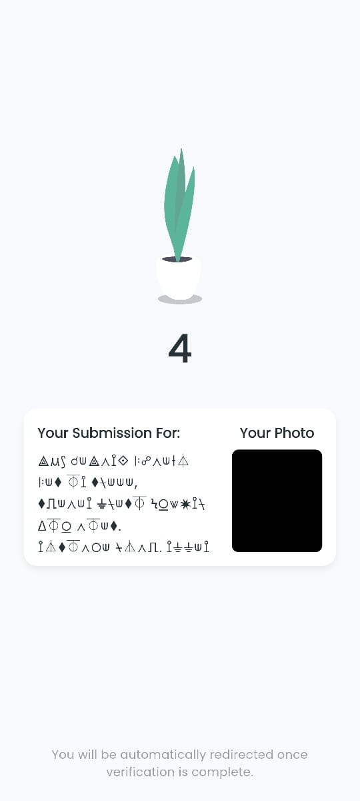
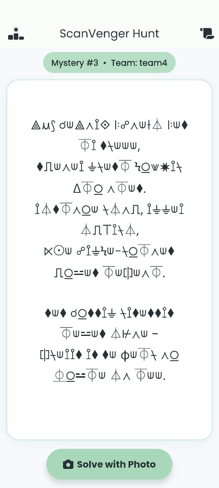
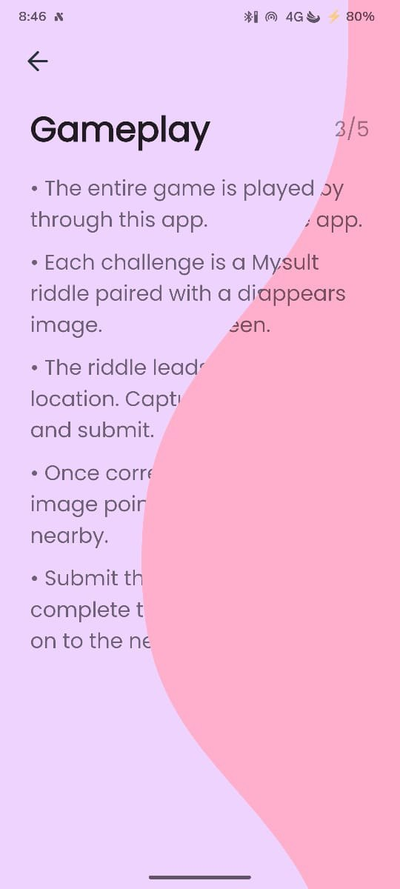
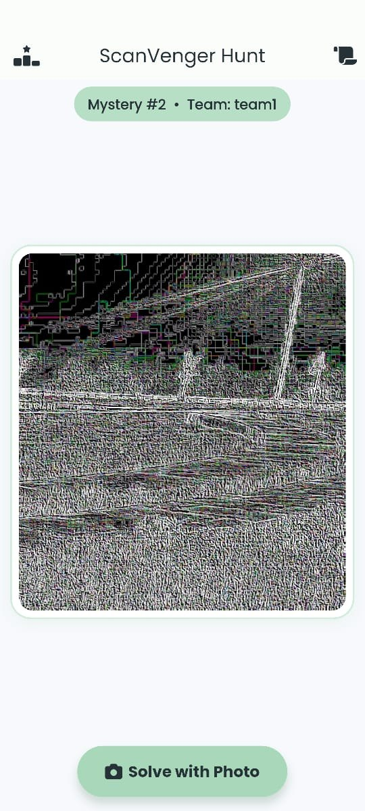
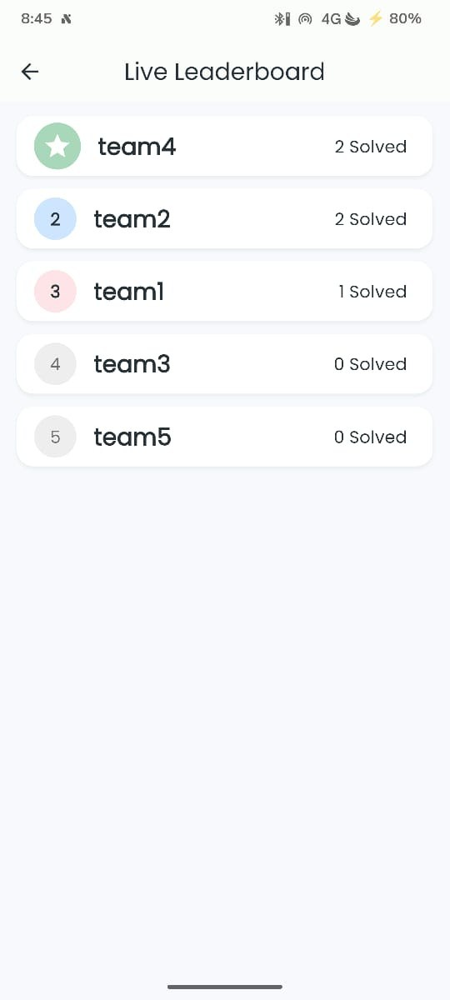

# ScanVenger Hunt 2

A dynamic, real-time scavenger hunt application built with Flutter for events. Features a player app and a web-based admin dashboard.

Created for **Team Green Campus Chapters (TGCC)** to host a campus-wide scavenger hunt.

### Showcase

<div style="display: flex; flex-wrap: wrap; gap: 10px;">
  
  
  
  
  
</div>

## Getting Started

### Prerequisites

- Flutter SDK
- Firebase Account
- Supabase Account

### Setup

1.  **Clone the repository**

2.  **Environment Variables**

    Create a `.env` file in the root directory and add your API keys:

    ```env
    FIREBASE_ANDROID_API_KEY=your_api_key
    FIREBASE_ANDROID_APP_ID=your_app_id
    FIREBASE_IOS_API_KEY=your_api_key
    FIREBASE_IOS_APP_ID=your_app_id
    SUPABASE_URL=your_supabase_url
    SUPABASE_ANON_KEY=your_supabase_key
    ```

3.  **Firebase Configuration**

    - Place your `google-services.json` in `android/app/`.
    - Place your `GoogleService-Info.plist` in `ios/Runner/`.

4.  **Run the App**

    ```bash
    flutter pub get
    flutter run
    ```

## Usage

### Authentication

- Users can sign in using the authentication screen.
- Supports email/password login (configured via Firebase).

### Player App

- **Home**: View available scavenger hunts and current progress.
- **Game**: Participate in active hunts, solve clues, and submit answers.
- **Leaderboard**: Check real-time rankings against other players.
- **Rules**: View the rules and regulations for the event.

### Admin Dashboard (Web)

- Access the admin panel to create and manage hunts.
- Monitor player submissions and approve/reject them in real-time.
- Manage leaderboard and game settings.
